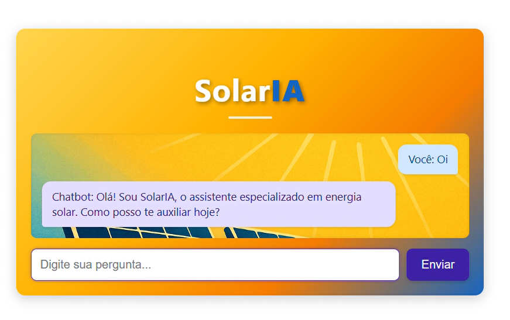
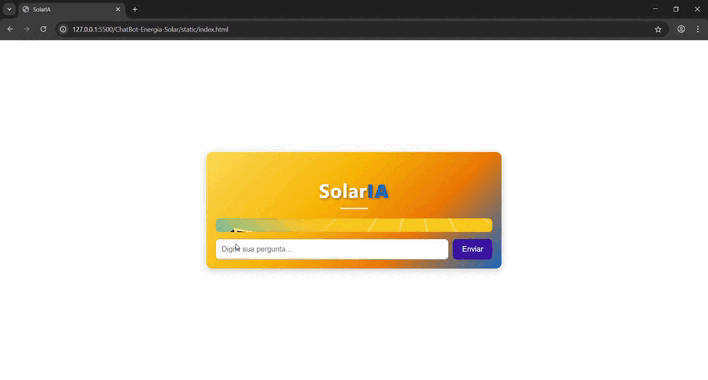

<h1 align="center"> SolarIA -ChatBot </h1>
<h2 align="center">Aprenda os conceitos básicos de energia solar de forma simples e interativa</h2> 
<p align="center">
</p>


## Descrição do projeto

<p>O <b>SolarIA</b> é um <b>chatbot vertical</b> que tem como objetivo ensinar de forma clara, simples e didática
a pessoas interessadas em energia solar, sejam elas, iniciantes, curiosos, empresas etc</p>
<h4 align="center"> :heavy_check_mark: Projeto Finalizado :heavy_check_mark:</h4>


## Índice 

* [Descrição do projeto](#descrição-do-projeto)
* [Funcionalidades e Demonstração da Aplicação](#funcionalidades-e-demonstração-da-aplicação)
* [Acesso ao Projeto](#acesso-ao-projeto)
* [Tecnologias utilizadas](#tecnologias-utilizadas)
* [Autores](#autores)
* [Pessoas Contribuidoras](#pessoas-contribuidoras)
* [Futuras melhorias](#futuras-melhorias)
* [Conclusão](#conclusão)

## Funcionalidades e Demonstração da Aplicação

- `Funcionalidade 1`:<b>Recebe perguntas:</b> recebe perguntas do usuário.
- `Funcionalidade 2`:<b>Devolve uma resposta:</b> responde com explicações simples e diretas.
- `Funcionalidade 3`:<b>Pergunta para incentivo:</b> sempre faz uma pergunta final para incentivar o usuário a continuar a conversa. 
- `Funcionalidade 4`:<b>Perguntas fora do contexto</b>  Lida com perguntas fora do tema, retornando uma mensagem educada.
- `Funcionalidade 5`:<b>Contexto mantido</b> mantém o contexto da conversa com utilização das threads, promovendo um aprendizado dinâmico e produtivo.

## Demonstração do projeto



## 🛠️ Abrir e rodar o projeto

### ✅ Pré-requisitos

- Python 3.8 ou superior
- Conta na [OpenAI](https://platform.openai.com/)
- Chave da API da OpenAI
- ID do Assistente (Assistant ID) criado na plataforma da OpenAI
- Git instalado (opcional, mas recomendado)

#### 1. Clone o repositório

Clone o repositório no terminal
``` bash 
git clone https://github.com/Agda-Cavalcanti/ChatBot-Energia-Solar.git
```

#### 2. Crie o arquivo .env com suas chaves
Crie um arquivo chamado .env na raiz do projeto com o seguinte conteúdo:
``` bash
OPENAI_API_KEY=sua_chave_aqui
ASSISTANT_ID=seu_assistant_id_aqui
```
🔒 Atenção: nunca compartilhe este arquivo publicamente! (Adicione o arquivo .env no .gitignore)

#### 3. Estrutura esperada do projeto
``` bash
ChatBot-Energia-Solar/
├── main.py
├──.gitignore
├──Logs.logs (Deve ser adicionado no .gitignore)
├── .env
├── utils/
│   └── logging_config.py
├── static/
│   └── index.html
    └── solar-backgroung.png
    └── style.css
```
#### 4. Inicie o servidor
``` bash
python main.py
```
A aplicação estará acessível em:

``` bash
(http://127.0.0.1:8000)
```
 #### 5. Teste com Postman (opcional)
 Envie um POST para /chat com um corpo como:
 ``` bash
{
  "pergunta": "O que é energia solar?"
}
```
E receba uma resposta como:
 ``` bash
{
  "resposta": "Energia solar é..."
}

```
 #### 6. Frontend (HTML opcional)
 Se quiser usar o arquivo index.html, abra no navegador. Ele já está configurado para se comunicar com o backend local.

  
# Tecnologias utilizadas
- Visual Studio Code (IDE)
- JavaScript 
- HTML 
- CSS
- GitHub Pages (Hospedagem da página)
- Trello 

# Autores
 ## 📄 Licença
Este projeto é apenas para fins educacionais.
Desenvolvido por [Agda Cavalcanti](https://github.com/Agda-Cavalcanti).
<br>
 


# Futuras melhorias
<p>:heavy_check_mark: O projeto foi concluído conforme o objetivo da Unidade Curricular de Inteligência Artificial, mas com oportunidades de melhorias.

Embora tenha cumprido todas as exigências da atividade, identifiquei algumas áreas que podem ser aprimoradas, como:</p>
-Hospedar código backend e fronted 
-Criação de login e armazenando de históricos de conversas para cada usuário
-Implementar banco de dados para controle de conversas
-Integração com apps (Como Whatsapp, Telegram…)


# Conclusão
<p>O ChatBot SolarIA e tecnologias similares são capazes de <b>democratizar o conhecimento</b> e promover o interesse em diversas áreas, interagindo de forma dinâmica e incentivando o usuário a continuar aprendendo novos tópicos.
</p>


<p align="center">
  
</p>


